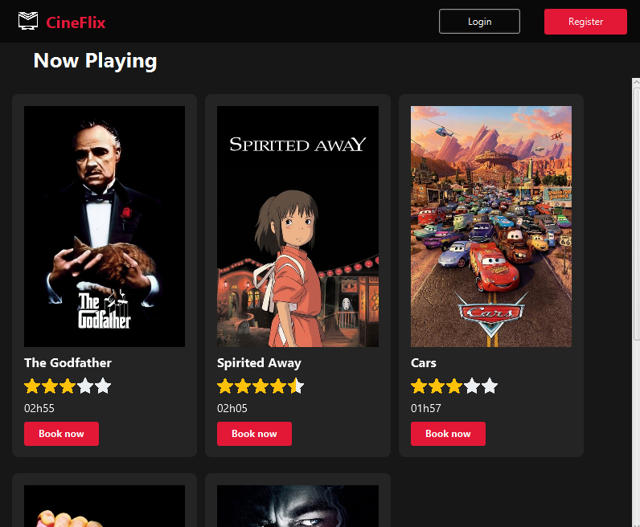
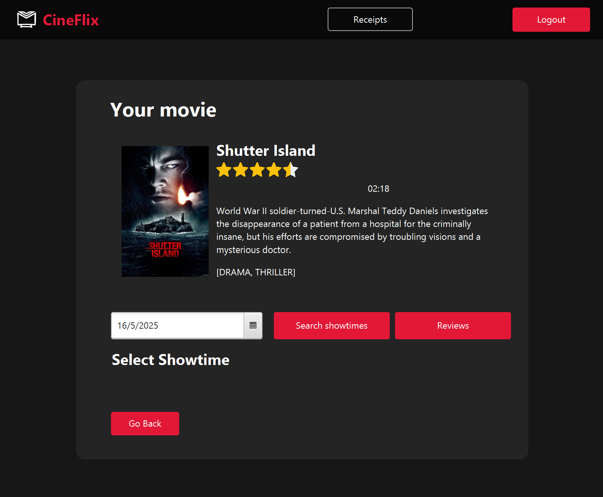
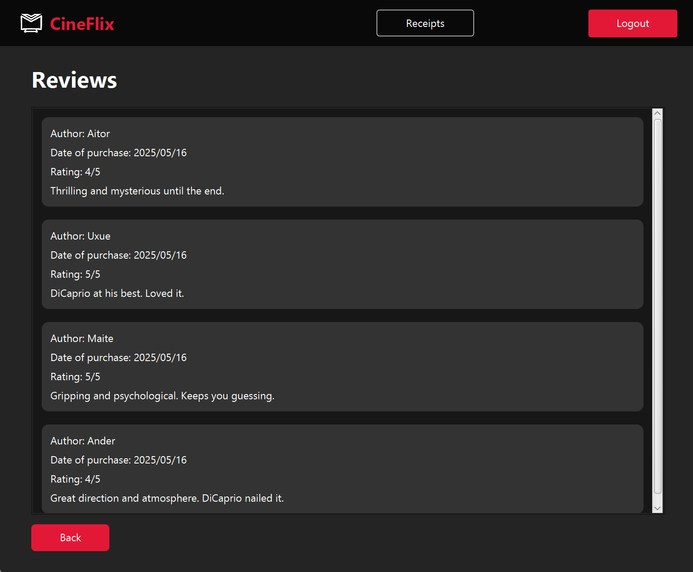
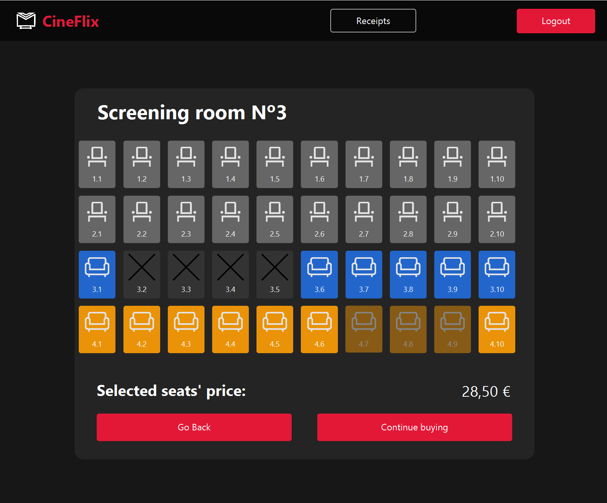
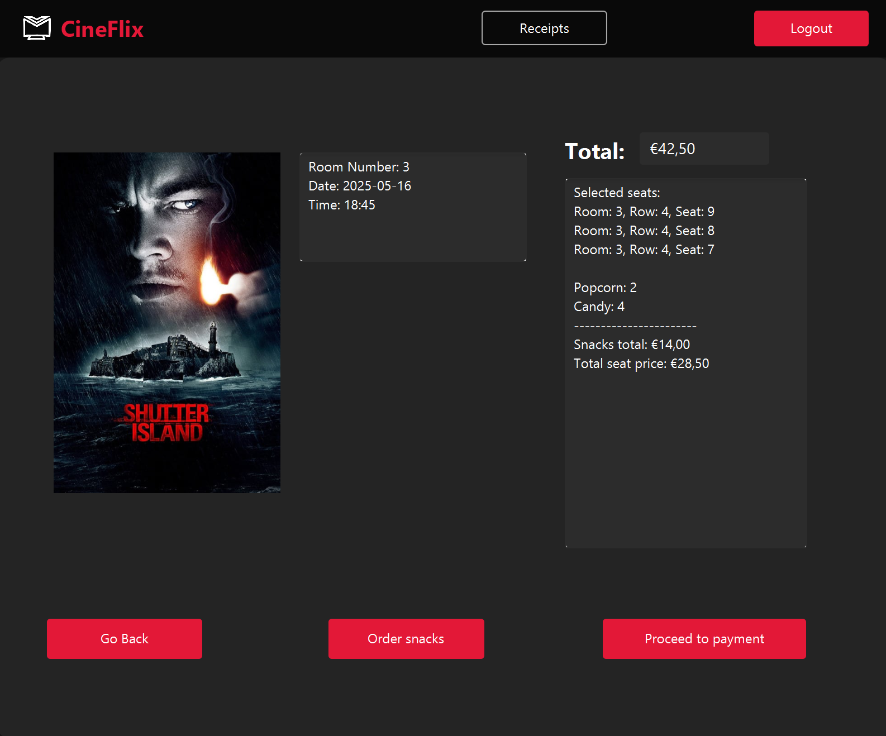

# Project about the management of a Cinema
## Screenshots
### Menu

The first screen you see when opening the app.  

### Customer Showtime
Information shown to the customer when selecting a movie.  

### Reviews
Section displaying reviews for a movie.  

### Seatview
View of available seats to select from.  

### Pay
Summary of the purchase, including tickets, snacks, and total price.  

### Admin Showtimes
Where the admin adds new showtimes.

---
### Description
A client-server application for managing movie listings, schedules, and ticket sales.
The system includes three user roles:

Admin: adds movies, creates showtimes, manages employees.

Employee: sells tickets to registered customers.

Customer: purchases tickets online.

---
### My role

This project was developed as a team assignment for the Software Engineering course at UPV/EHU.
As part of the team, I took on the role of Scrum Master, coordinating the team's workflow and ensuring timely progress.

In addition, I actively contributed to all areas of development, from the backend API integration and business logic, to the user interface implementation and testing.
This hands-on approach allowed me to gain experience in the full software development cycle, collaborating closely with my teammates.

---
### Setup
To run the project, you need to create a .env file in the root directory with the following content:
API_KEY=*your_tmdb_api_key_here*
Replace *your_tmdb_api_key_here* with your own TMDB API key.
The Movie Database (TMDB) API is a free API that provides access to a vast collection of movie data, including information about movies, TV shows, actors, and more. 
You can sign up for a free account and obtain a free API key at [TMDB](https://www.themoviedb.org/documentation/api).

### Test Users

The system comes with several pre-configured test users for different roles:

#### Admin User

- Email: admin@example.com
- Password: admin1234
- Name:  Admin Admin

#### Worker Users

1. John Smith

   - Email: jsmith@example.com
   - Password: 12345678
   - 
2. Emily Johnson

   - Email: ejohnson@example.com
   - Password: 87654321

3. Michael Brown

   - Email: mbrown@example.com
   - Password: abcdefghi

4. Sophia Martinez

   - Email: smartinez@example.com
   - Password: 12345678

5. Daniel Garcia
   - Email: dgarcia@example.com
   - Password: 111222333g

#### Customer Users

1. Aitor Elizondo

   - Email: aitor@gmail.com
   - Password: 12345

2. Amaia Susperregi

   - Email: amaia@gmail.com
   - Password: 12345

3. Uxue Etxebeste
   - Email: uxue@gmail.com
   - Password: 12345

These test users are automatically created when the database is initialized with the "initialize" mode set in the configuration.
